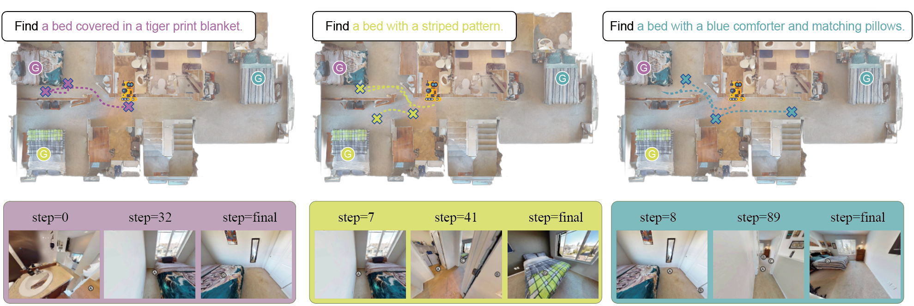

# Uncertainty Conqueror: Curiosity-Driven Zero-Shot Object Navigation with Vision-Language Models

### Abstract

The ability of an agent to navigate towards specific objects in unknown environments is a crucial aspect of Embodied Intelligence, which is known as Zero-Shot object navigation. Despite the advent of preceding learning-based methodologies and modular approaches, the task persists in failing to attain optimal outcomes, due to poor exploratory sufficiency and deficient decision quality. In this work, we leveraged the powerful reasoning capabilities of vision-language models (VLMs) to simulate human-like assessments of environmental suitability for exploration when searching for a target. This was then quantified into a value map. To enhance the efficacy of exploration during navigation, we directed the agent to focus on high-value areas. By guiding the agent's navigation, we applied value penalties to refine the value map, ensuring that at every decision point, the agent could discern between environments meriting further exploration and those that do not. We evaluate our method on the challenging HM3D dataset and demonstrate that it outperforms existing state-of-the-art methods, achieving a nearly 21\% improvement in success rate. Through qualitative analysis, we show that maintaining a moderate level of curiosity significantly benefits navigation performance, and our framework effectively handles complex navigation goals.

